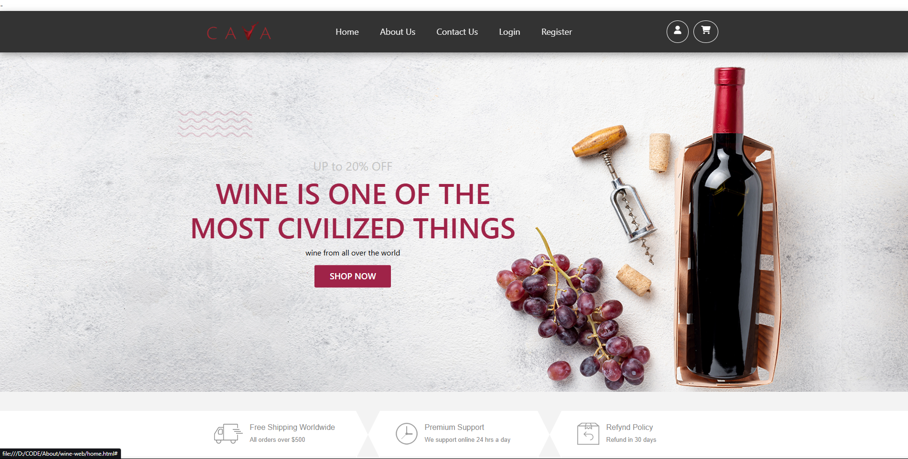
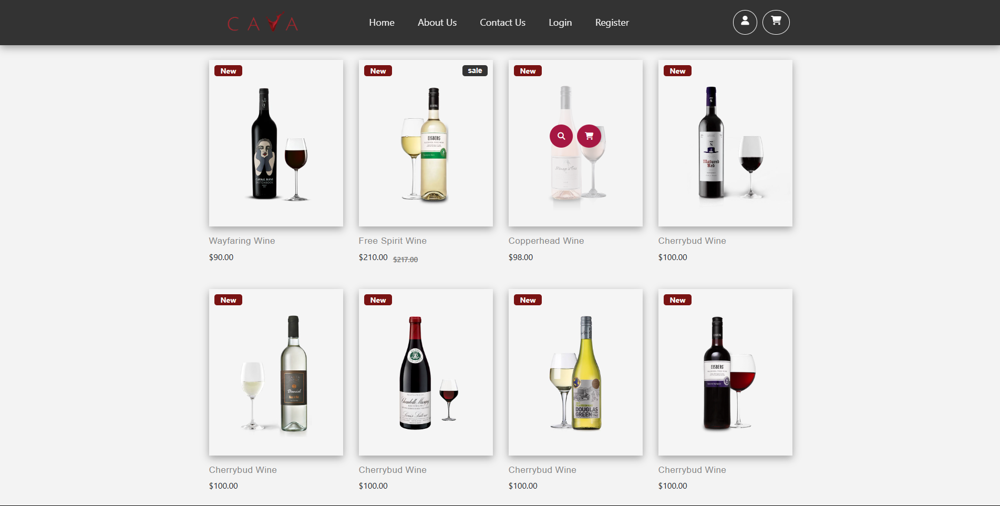
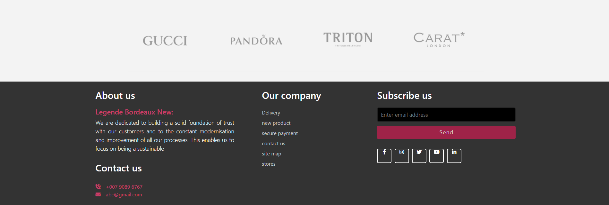

# wine-website-for-online-buying-e_commerce-website
Vine Wine is a sleek, responsive website designed to showcase premium wines. Built with HTML and CSS, it features a modern layout, elegant visuals, and user-friendly navigation. Ideal for wineries or wine sellers looking to create a stylish online presence and connect with wine lovers.

=====================================================

                 WINE E-COMMERCE WEBSITE
                 
=====================================================

Project Title:     CAVA - Online Wine Store
Developer:         Poorv Patel
Created On:        me and my friend
Technologies:      HTML, CSS, JavaScript
Files Included:    home.html, about.html, contact.html, login.html, register.html, CSS folder, JS folder, images, etc.

-----------------------------------------------------
PROJECT PHOTOS
-----------------------------------------------------

🌐 Website Preview

🏠 Homepage

- Hero section with promotional banner
- Featured call-to-action: "Wine is one of the most civilized things"
- "Shop Now" button
- Info banners for shipping, support, and refund policy

🛒 Product Listing

- Grid view of new wine products
- Product name, price, and label tags (e.g., *New*, *Sale*)
- Hover effects for interaction (zoom, add to cart)

📞 Footer & About Us

- Brand partner section (Gucci, Pandora, etc.)
- About the company
- Contact details
- Newsletter subscription form
- Social media links

-----------------------------------------------------
PROJECT DESCRIPTION
-----------------------------------------------------

CAVA is a front-end e-commerce wine shop showcasing different wine products. This website demonstrates basic functionality for an online store, including product listings, informational pages, and user interactions like login/register.

The homepage features promotional banners, new product highlights, and links to wine product details. The aesthetic is modern and clean, designed for a smooth user experience.

-----------------------------------------------------
KEY FEATURES
-----------------------------------------------------

1. 🛍️ Wine Product Listings
   - Displayed with images, names, prices, and "New"/"Sale" labels.
   - Interactive buttons for view/add to cart.

2. 🏠 Home Page
   - Banner: “Wine is one of the most civilized things” with a "Shop Now" CTA.
   - Visual appeal using wine bottle, grapes, corkscrew.

3. 📄 About Us
   - Company philosophy, sustainability statement, contact info.

4. 📞 Contact Us Page
   - Simple layout for users to get in touch.

5. 🔐 Login & Register Pages
   - Basic forms to simulate authentication interface.

6. 📦 Footer Information
   - Free shipping, support info, refund policy.
   - Social media icons and subscription input.

-----------------------------------------------------
HOW TO RUN
-----------------------------------------------------

1. Download or extract the `Vine-web.zip` file.
2. Open `home.html` in your preferred browser.
3. Navigate through other pages via the top navigation bar.

-----------------------------------------------------
FOLDER STRUCTURE
-----------------------------------------------------

/Vine-web

│
├── home.html
│
├── about.html
│
├── contact.html
│
├── login.html
│
├── register.html
│
├── css/
│   │
│   └── [All CSS styles]
│
├── js/
│   │
│   └── [Optional JS files if any]
│
├── images/
│   │
│   └── [All image assets]

-----------------------------------------------------
CREDITS
-----------------------------------------------------

Images: Used for educational/demo purposes (wine bottles, grapes, etc.)
Design Inspiration: Wine e-commerce templates

-----------------------------------------------------
DISCLAIMER
-----------------------------------------------------

This project is for educational purposes only. No actual e-commerce backend or payment gateway is implemented.

-----------------------------------------------------
CONTACT
-----------------------------------------------------

Email: Poorvhudka47@gmail.com

=====================================================
